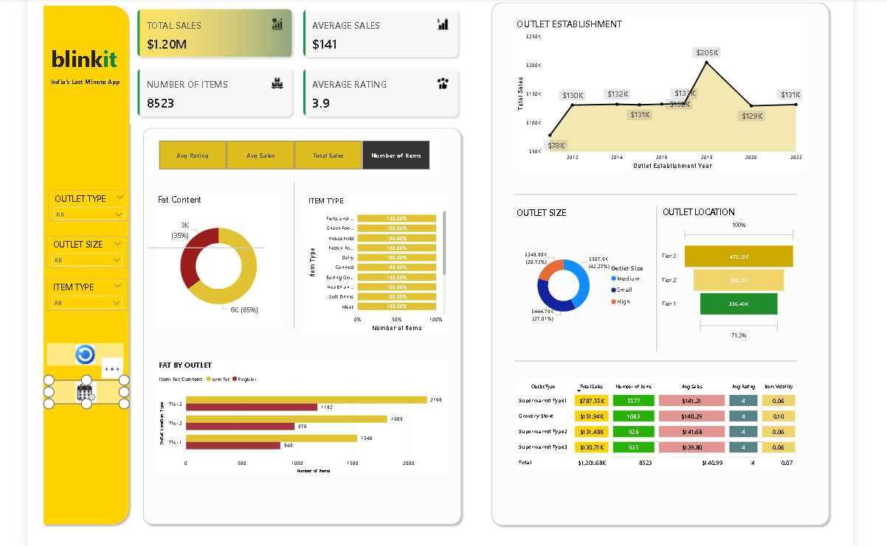

# PowerBI
Sales Analysis
This Power BI dashboard visualizes item sales data from 2010–2022. It includes interactive visualizations, slicers, and advanced UX features.

## 🔦 Features
- 📊 Charts and KPIs for sales, ratings, item type, outlet size/type
- 🔍 Interactive slicers for filtering by outlet, size, and item

## 📁 Files
- `pj bk.pbix` — Main Power BI dashboard file

## 🧰 Tools Used
- Power BI Desktop
- Buttons
- DAX for KPI and calculated values

## 📸 Screenshot

